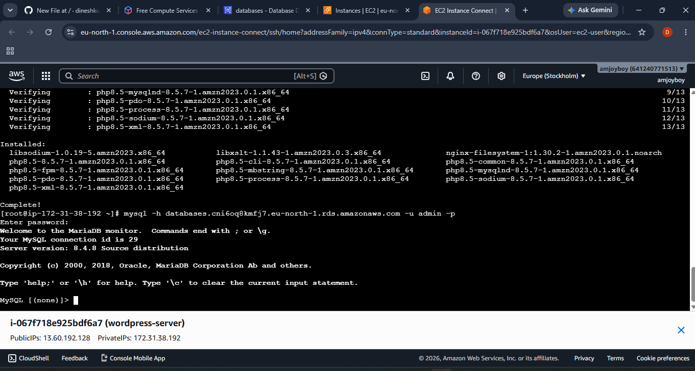
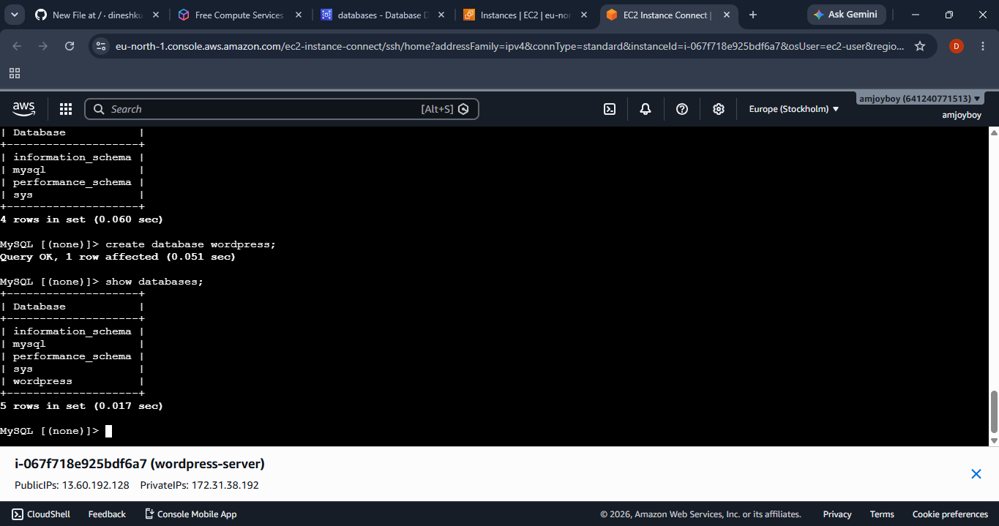
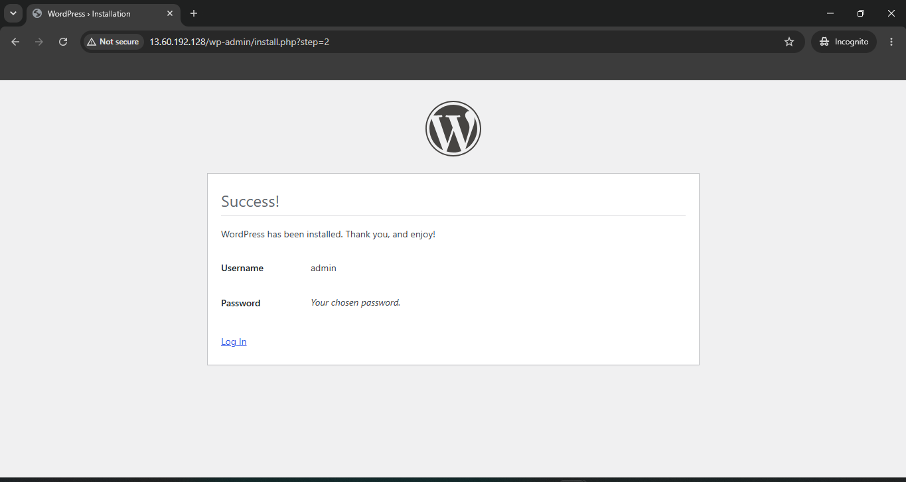
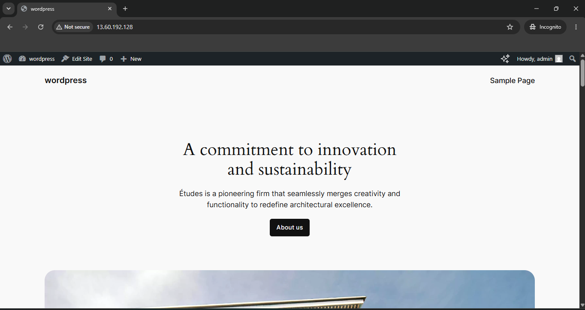

<div align="center">

# ☁️ WordPress Infrastructure on AWS

### Deploying a Production-Ready WordPress Website Using Amazon EC2 and Amazon RDS (MySQL)


</div>

---

# 📖 Project Overview

This project demonstrates the deployment of a **WordPress website** on **Amazon Web Services (AWS)** using **Amazon EC2** as the web server and **Amazon RDS (MySQL)** as the backend database.

The application is hosted on an **Amazon Linux 2023 EC2 instance** running **Apache** and **PHP**, while the WordPress database is securely stored in **Amazon RDS**. This architecture separates the web and database layers, improving scalability, reliability, and security.

---

# 🏗️ Architecture

```text
                     Internet
                         │
                   Public IP Address
                         │
               +----------------------+
               |      Amazon EC2      |
               | Apache + PHP         |
               | WordPress Website    |
               +----------+-----------+
                          │
                     MySQL Port 3306
                          │
               +----------▼-----------+
               |     Amazon RDS       |
               |        MySQL         |
               | WordPress Database   |
               +----------------------+
```

---

# ☁️ AWS Services Used

- Amazon EC2
- Amazon RDS (MySQL)
- Amazon VPC
- Security Groups
- Internet Gateway
- Amazon Linux 2023
- Apache HTTP Server
- PHP 8.5
- MariaDB Client
- WordPress

---

# 🚀 Features

- WordPress hosted on Amazon EC2
- Amazon RDS MySQL Database
- Apache HTTP Server
- PHP 8.5 Runtime
- Secure EC2–RDS Connectivity
- Web and Database Tier Separation
- WordPress Installation Wizard
- WordPress Administration Dashboard

---

# 🛠️ Implementation Steps

## Step 1 – Launch an EC2 Instance

- Amazon Linux 2023
- Configure Security Group
- Allow SSH (22)
- Allow HTTP (80)

---

## Step 2 – Install Apache & PHP

```bash
sudo dnf install httpd -y
sudo systemctl enable httpd
sudo systemctl start httpd

sudo dnf install php php-mysqlnd php-fpm php-json php-gd php-mbstring php-xml -y
```

---

## Step 3 – Download WordPress

```bash
wget https://wordpress.org/latest.tar.gz

tar -xvf latest.tar.gz

sudo cp -r wordpress/* /var/www/html/
```

---

## Step 4 – Create Amazon RDS

- Engine: MySQL
- Create Database Instance
- Configure Security Group
- Allow MySQL Port (3306)

---

## Step 5 – Install MariaDB Client

```bash
sudo dnf install mariadb105 -y
```

---

## Step 6 – Connect EC2 to Amazon RDS

```bash
mysql -h <RDS-ENDPOINT> -u admin -p
```

---

## Step 7 – Create WordPress Database

```sql
CREATE DATABASE wordpress;

SHOW DATABASES;
```

---

## Step 8 – Configure WordPress

```bash
cp wp-config-sample.php wp-config.php

vi wp-config.php
```

Update:

```php
DB_NAME='wordpress'
DB_USER='admin'
DB_PASSWORD='YourPassword'
DB_HOST='RDS-Endpoint'
```

---

## Step 9 – Complete WordPress Installation

Open your browser:

```
http://<EC2-Public-IP>
```

Complete the installation wizard and log in to the WordPress dashboard.

---

# 📸 Project Screenshots

## 🔗 EC2 Connected to Amazon RDS

Successfully connected the Amazon EC2 instance to the Amazon RDS MySQL database using the MariaDB client.



---

## 🗄️ WordPress Database Created

Created the **wordpress** database inside Amazon RDS and verified it using the `SHOW DATABASES;` command.



---

## 🎉 WordPress Installation Completed

Successfully completed the WordPress installation wizard and configured the administrator account.



---

## 🌐 Live WordPress Website

Final deployed WordPress website running successfully on Amazon EC2 with Amazon RDS as the backend database.



---

# 📁 Project Structure

```text
wordpress-infrastructure-on-aws/
│
├── README.md
├── ec2-rds-database-connection.png
├── wordpress-database-created.png
├── wordpress-installation-success.png
└── wordpress-homepage.png
```

---

# 🎯 Skills Demonstrated

- Amazon EC2
- Amazon RDS
- WordPress Deployment
- Apache HTTP Server
- PHP
- MariaDB Client
- Linux Administration
- VPC
- Security Groups
- Cloud Infrastructure

---

# 📚 Learning Outcomes

- Deployed WordPress on Amazon EC2.
- Installed and configured Apache and PHP.
- Created an Amazon RDS MySQL database.
- Connected EC2 to RDS using the MariaDB client.
- Configured WordPress with an external database.
- Completed the WordPress installation process.
- Successfully hosted a live WordPress website on AWS.

---

# 👨‍💻 Author

**Dineshkumar R**

**Aspiring AWS Cloud & DevOps Engineer**

- GitHub: https://github.com/dineshkumarrp22-ops
- LinkedIn: www.linkedin.com/in/dinesh-kumar-engr

---

<div align="center">

### ⭐ If you found this project helpful, consider giving it a Star!

🚀 Thank you for visiting my repository.

</div>
